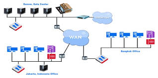
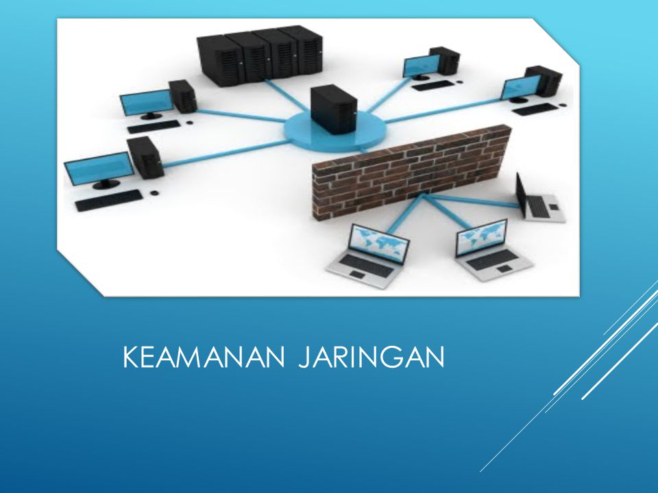

## Jaringan Nirkabel
    Jaringan nirkabel adalah suatu jaringan yang mengghubungkan unit komputer yang jauh atau dekat menggunakan tanpa kabel.

  ###Keamanan Jaringan 
   keamanan jaringan sagatlah retang karena pengguna lain bisa disadap atau saling sadap ,kalo misalnya kita kirim data lewat udara bebas.
   ada beberapa cara untuk mengatasi jaringan diantara lain sebagai berikut;
   
-  (Wired Equivalent Privacy) cara ini dengan mengandingkan data tersebut.WEP didasarkan pada algoritma enkripsi, dimana RA4 itu dengan 
       mengandingkan data menggunakan kunci, kuncinya itu berbeda dengan penerima dan pengirim ,RSA kuncinya sama hanya saja betnya diputar 
       antara pengirim dan penerima.
- SSID (Service Set Identifier) cara ini ini berupa password sederhana untuk menghindari pengaruh yang tidak bertanggung jawab ,maka password dirubah 
  secara bertahap.
- Filter Alamat MAC (Media Access Control), cara ini membantu menangkal pengguna akses pada jaringan WLAN yang mau masuk kealamat MAC.
 

     Gambar, keamanan jaringan

          

